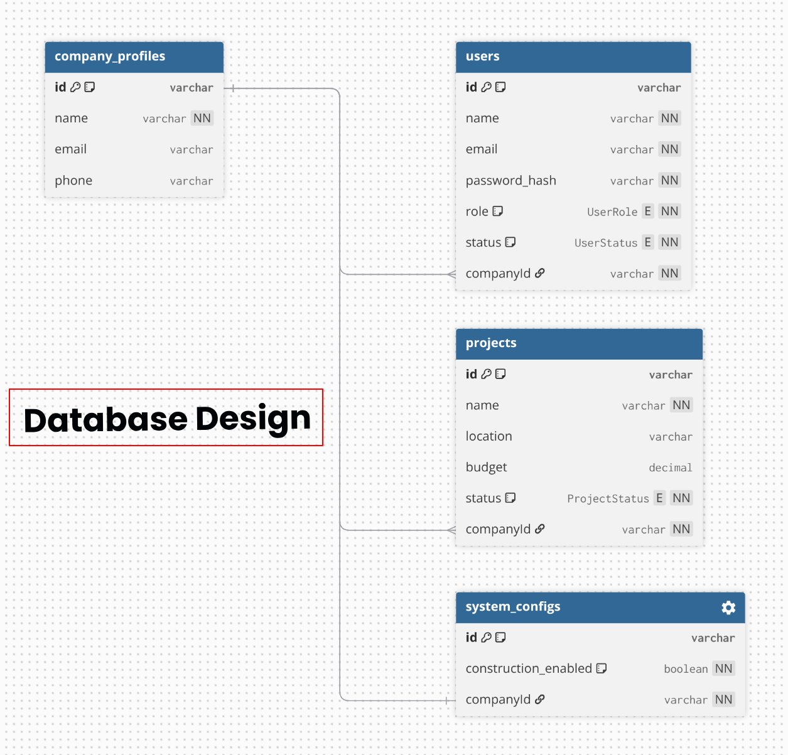

# ProManager — Multi-Company Project Management System

A full-stack project management platform built for HR/construction teams. Each company gets its own isolated workspace with users, projects, and system configuration.

---

## 1. Short Explanation

ProManager is a **multi-tenant** web application where each company operates in its own isolated environment. The system supports:

- **Admin authentication** — Secure JWT-based login for the admin user
- **Company-scoped data** — All queries are filtered by `companyId`, ensuring tenant isolation
- **Project lifecycle management** — Track projects through PLANNING → ACTIVE → ON_HOLD → COMPLETED / CANCELLED
- **Simplified HR-aligned schema** — Minimal, clean tables matching HR department requirements

**How it works:**
1. A company is created with a system config via the seed script
2. The admin user authenticates via JWT
3. The admin manages projects (CRUD), company profile, and system settings
4. All data is scoped to the admin's company

---

## 2. DB Design

The database has **4 tables** with clean relationships. Use the DBML below on [dbdiagram.io](https://dbdiagram.io) to visualize.



### Relationships

| Relationship | Type | Description |
|---|---|---|
| `company_profiles` → `users` | 1:N | A company has many users |
| `company_profiles` → `projects` | 1:N | A company has many projects |
| `company_profiles` → `system_configs` | 1:1 | Each company has one config |

---

## 3. Auth Flow

```
┌─────────┐         ┌──────────┐         ┌────────────┐
│  Client  │         │  Server  │         │  Database  │
└────┬────┘         └─────┬────┘         └──────┬─────┘
     │                    │                     │
     │  POST /auth/login  │                     │
     │  {email, password} │                     │
     │───────────────────>│                     │
     │                    │  Find user by email  │
     │                    │────────────────────>│
     │                    │    user record       │
     │                    │<────────────────────│
     │                    │                     │
     │                    │  bcrypt.compare(     │
     │                    │    password,         │
     │                    │    user.password_hash)│
     │                    │                     │
     │                    │  Check user.status   │
     │                    │  === 'ACTIVE'        │
     │                    │                     │
     │                    │  jwt.sign({userId})  │
     │  {user, token}     │                     │
     │<───────────────────│                     │
     │                    │                     │
     │  localStorage.set  │                     │
     │  ('token', jwt)    │                     │
     │                    │                     │
     │  GET /projects     │                     │
     │  Authorization:    │                     │
     │  Bearer <jwt>      │                     │
     │───────────────────>│                     │
     │                    │  jwt.verify(token)   │
     │                    │  → {userId}          │
     │                    │                     │
     │                    │  Find user, check    │
     │                    │  status === ACTIVE   │
     │                    │────────────────────>│
     │                    │  req.user =          │
     │                    │  req.companyId =     │
     │                    │                     │
     │                    │  Query projects      │
     │                    │  WHERE companyId =   │
     │                    │  req.companyId       │
     │                    │────────────────────>│
     │  {projects}        │                     │
     │<───────────────────│                     │
```

**Key points:**
- Passwords are hashed with **bcrypt** (12 salt rounds) and stored as `password_hash`
- JWT tokens are signed with a secret from env and sent as both a **cookie** and in the response body
- The `authenticate` middleware extracts the token from `Authorization: Bearer <token>` header or cookie
- Every protected route attaches `req.user` and `req.companyId` for downstream tenant isolation
- Inactive users (`status !== ACTIVE`) are rejected at the middleware level

---

## 4. Company Structure

```
CompanyProfile (ProManager Inc.)
├── SystemConfig
│   └── construction_enabled: true
│
├── Users
│   └── Admin User [ADMIN] → Full access
│
└── Projects (all scoped to this company)
    ├── Skyline Tower Expansion  [ACTIVE]     $2,000,000  Chicago
    ├── Harbor Bridge Renovation [PLANNING]   $850,000    Chicago
    └── Metro Station Redesign   [COMPLETED]  $1,200,000  Chicago
```

### Admin Capabilities

| Action | Admin |
|---|:---:|
| View dashboard | ✅ |
| View projects | ✅ |
| Create project | ✅ |
| Edit project | ✅ |
| Delete project | ✅ |
| Edit company profile | ✅ |
| Edit system config | ✅ |

---

## Tech Stack

- **Frontend:** React 19, Vite, TailwindCSS 4, React Router, Axios, Lucide Icons
- **Backend:** Node.js, Express.js, Prisma ORM
- **Database:** PostgreSQL (Neon)
- **Auth:** JWT + bcrypt

## Getting Started

### Prerequisites
- Node.js v18+
- PostgreSQL database (local or hosted, e.g. Neon)

### Backend Setup
```bash
cd server
cp .env.example .env        # Edit with your DB credentials
npm install
npx prisma generate          # Generate Prisma client
npx prisma migrate dev       # Run database migrations
node prisma/seed.js          # Seed initial data
npm run dev                  # Start dev server on port 5000
```

### Frontend Setup
```bash
cd client
npm install
npm run dev                  # Start Vite dev server on port 5173
```

### Demo Credentials
| Email | Password |
|---|---|
| `admin@promanager.com` | `Admin@123` |

## API Endpoints

### Auth
| Method | Route | Auth | Description |
|---|---|---|---|
| POST | `/api/auth/register` | No | Register user (`name`, `email`, `password`, `companyId`) |
| POST | `/api/auth/login` | No | Login → JWT |
| GET | `/api/auth/me` | Yes | Get profile |
| POST | `/api/auth/logout` | Yes | Clear cookie |

### Projects (all require auth)
| Method | Route | Roles | Description |
|---|---|---|---|
| GET | `/api/projects` | Any | List (filter by status, search, paginate) |
| GET | `/api/projects/stats` | Any | Dashboard stats |
| GET | `/api/projects/:id` | Any | Get single project |
| POST | `/api/projects` | Admin | Create project |
| PATCH | `/api/projects/:id` | Admin | Update project |
| DELETE | `/api/projects/:id` | Admin | Delete project |

### Company (all require auth)
| Method | Route | Roles | Description |
|---|---|---|---|
| GET | `/api/company/profile` | Any | Company info + config + counts |
| GET | `/api/company/members` | Any | List active team members |
| PATCH | `/api/company/profile` | Admin | Update company name/email/phone |
| PATCH | `/api/company/config` | Admin | Update system config |

### Other
| Method | Route | Description |
|---|---|---|
| GET | `/api/health` | Health check |
